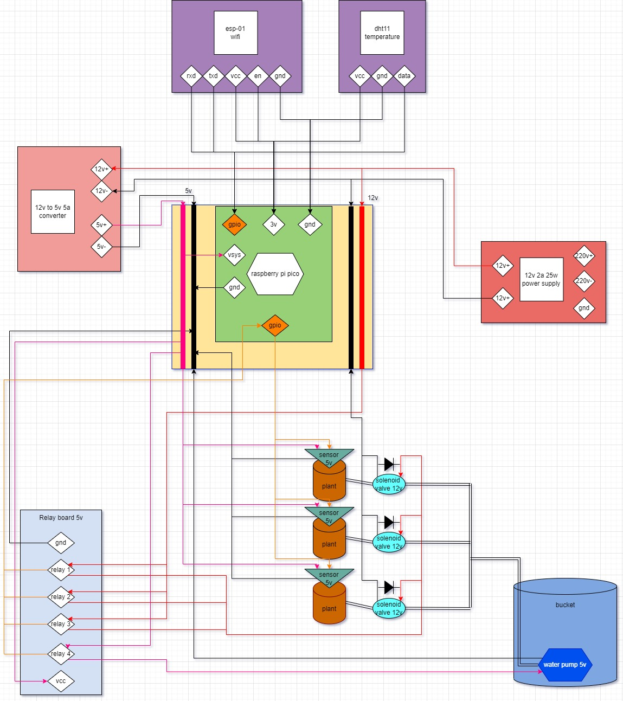
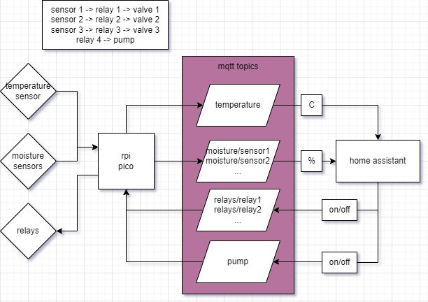

# rpi-pico-watering-system

## TODO
- hardware
  -  [ ] make a first version of the circuit only with the rpi pico and wifi board for mqtt testing
- software
  - [x] figure out data flow between rpi pico and homeassistant with mqtt broker
  - [x] create data model for mqtt topics
  - [x] figure out how homeassistant can read data from mqtt and set thresholds for soil moisture and trigger a publish to relay topic that opens the relay for the specific sensor
  - [ ] create micro python script for rpi pico that connects to local wifi with esp-01 and sends to mqtt topics the sensors data
