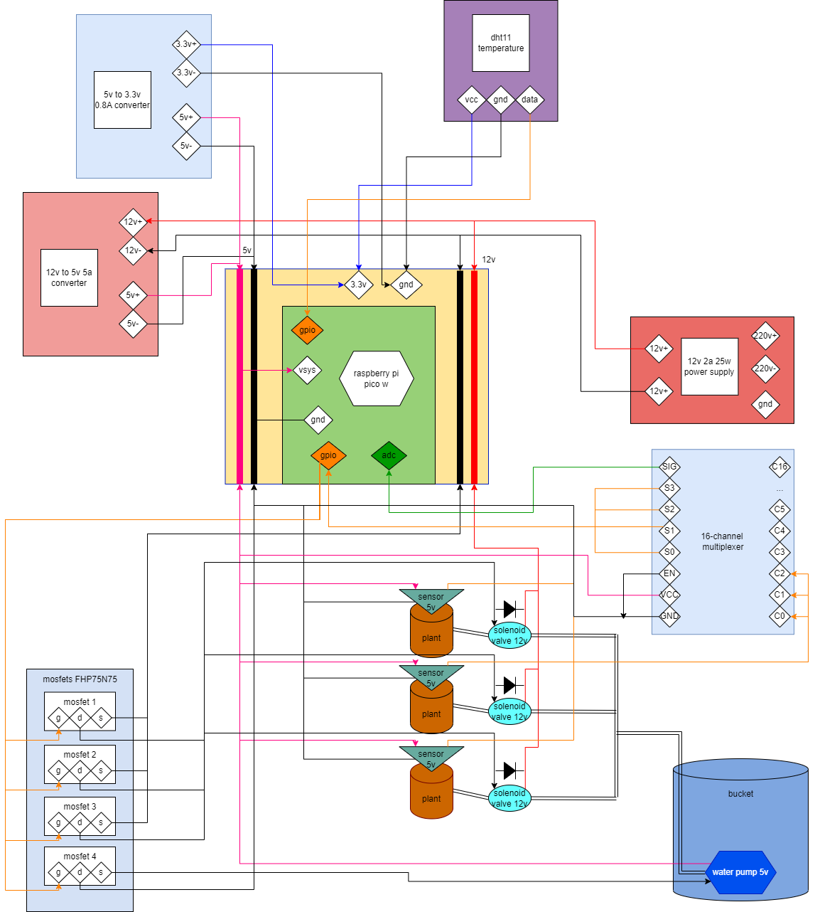
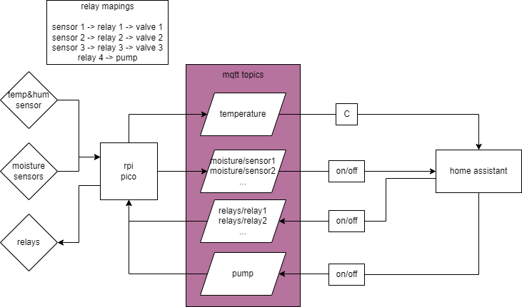

# rpi-pico-watering-system

## Circuit diagram

## Data flow

## TODO
### hardware
- [ ] make a proof of concept version of the circuit with a breadbord
- [ ] test adc multiplexer
- [ ] put everything together inside an electronics box
- [ ] connect the water tubes circuit
### software
- [x] figure out data flow between rpi pico and homeassistant with mqtt broker
- [x] create data model for mqtt topics
- [x] figure out how homeassistant can read data from mqtt and set thresholds for soil moisture and trigger a publish to relay topic that opens the relay for the specific sensor
- [x] create micro python script for rpi pico that connects to local wifi and sends to mqtt topics the sensors data
- [ ] refactor script to use esphome

## Setup
1. rename `secrets.py.sample` to `secrets.py`
2. install umqtt.simple from Thonny package manager
3. run the `main.py` script
